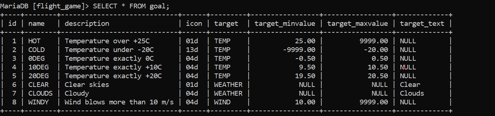
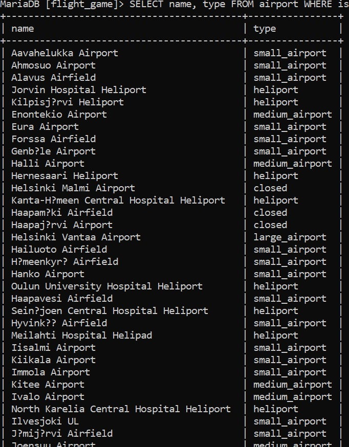
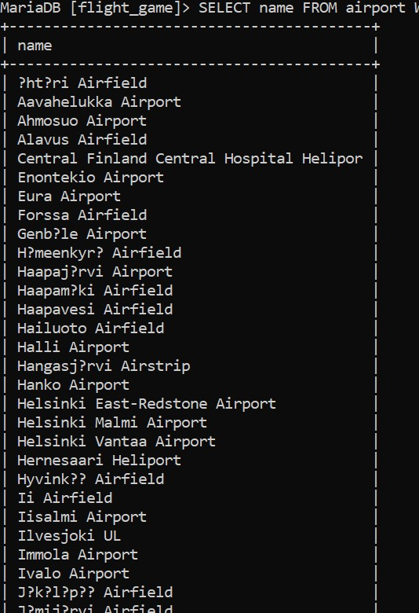
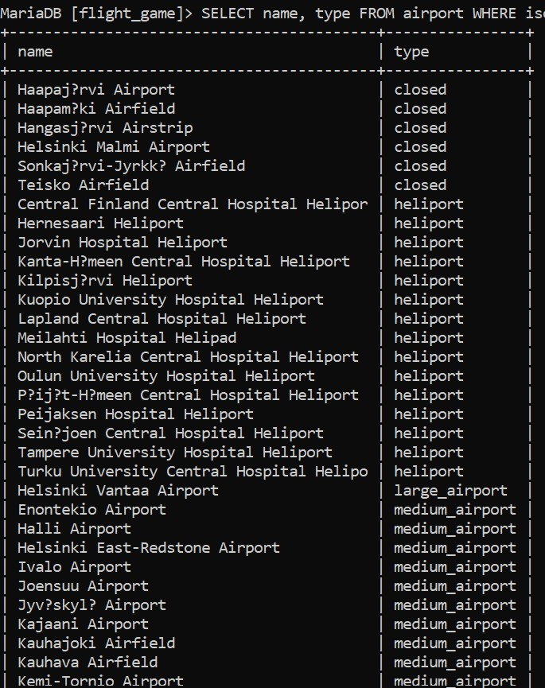
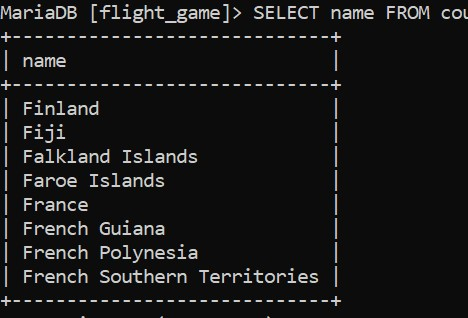
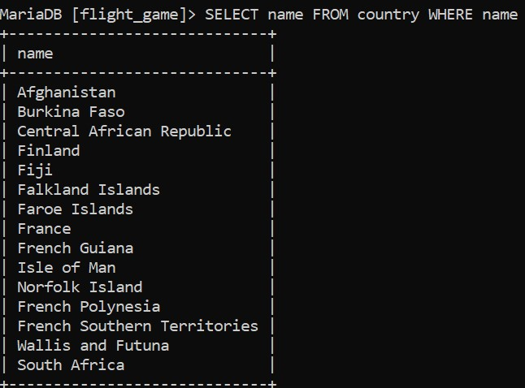
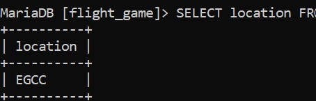
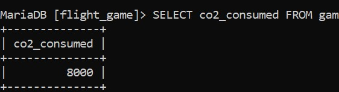
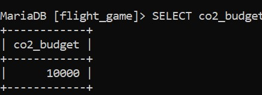

# Week 3
# Exercise 2

## Task 1
SELECT * FROM goal;

## Task 2
SELECT name, type FROM airport WHERE iso_country = "FI";

## Task 3
SELECT name FROM airport WHERE iso_country = 'FI' ORDER BY name ASC;

## Task 4
SELECT name, type FROM airport WHERE iso_country = 'FI' ORDER BY type ASC, name ASC;

## Task 5
SELECT name FROM country WHERE name LIKE "F%";

## Task 6
SELECT name FROM country WHERE name LIKE "%F%";

## Task 7
SELECT location FROM game WHERE screen_name = "Vesa";

## Task 8
SELECT co2_consumed FROM game WHERE screen_name = "Ilkka";

## Task 9
SELECT co2_budget FROM game LIMIT 1;

## Task 10
SET @co2_budget := (SELECT co2_budget FROM game WHERE screen_name = "Ilkka"); SET @co2_consumed := (SELECT co2_consumed FROM game WHERE screen_name = "Ilkka"); SELECT screen_name, @co2_budget AS co2_budget, @co2_consumed AS co2_consumed, (@co2_budget - @co2_consumed) AS co2_left FROM game WHERE screen_name = "Ilkka";

