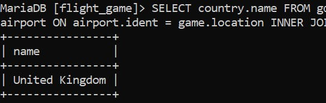

# Week 03
# Exercise 03

## Task 01
SELECT country.name AS "country name", airport.name AS "airport name" FROM country JOIN airport ON country.iso_country = airport.iso_country WHERE country.name = "Iceland";

## Task 02
SELECT airport.name AS "airport name" FROM airport JOIN country ON airport.iso_country = country.iso_country WHERE country.name = "France" AND airport.type = "large_airport";

## Task 03
SELECT country.name AS "country_name", airport.name AS "airport_name" FROM country JOIN airport ON country.iso_country = airport.iso_country WHERE country.continent = "AN";

## Task 04
SELECT airport.elevation_ft FROM airport JOIN game ON airport.ident = game.location WHERE game.screen_name = "Heini";

## Task 05
SELECT airport.elevation_ft * 0.3048 AS "elevation_m" FROM airport JOIN game ON airport.ident = game.location WHERE game.screen_name = "Heini"

## Task 06
SELECT airport.name FROM airport JOIN game ON airport.ident = game.location WHERE game.screen_name = "Ilkka";

## Task 07
SELECT country.name FROM country JOIN airport ON airport.iso_country = country.iso_country JOIN game ON airport.ident = game.location WHERE game.screen_name = "Ilkka";

## Task 08
SELECT goal.name FROM goal_reached INNER JOIN goal ON goal_reached.goal_id = goal.id INNER JOIN game ON goal_reached.game_id = game.id WHERE game.screen_name = "Heini";

## Task 09
SELECT airport.name FROM goal_reached INNER JOIN goal ON goal_reached.goal_id = goal.id INNER JOIN game ON goal_reached.game_id = game.id INNER JOIN airport ON airport.ident = game.location WHERE game.screen_name = "Ilkka" AND goal.name = "CLOUDS";

## Task 10
SELECT country.name FROM goal_reached INNER JOIN goal ON goal_reached.goal_id = goal.id INNER JOIN game ON goal_reached.game_id = game.id INNER JOIN airport ON airport.ident = game.location INNER JOIN country ON country.iso_country = airport.iso_country WHERE game.screen_name = "Ilkka" AND goal.name = "CLOUDS";

