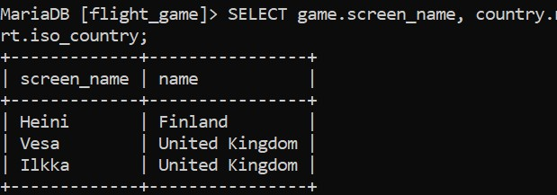

# Week 04
# Exercise 04

## Task 01
SELECT country.name AS "country name", airport.name AS "airport name" FROM country INNER JOIN airport ON airport.iso_country = country.iso_country WHERE country.name = "Finland" AND airport.scheduled_service = "yes";

## Task 02
SELECT game.screen_name, airport.name FROM game INNER JOIN airport ON airport.ident = game.location;

## Task 03
SELECT game.screen_name, country.name FROM game INNER JOIN airport ON airport.ident = game.location INNER JOIN country ON country.iso_country = airport.iso_country;

## Task 04
SELECT airport.name, game.screen_name FROM airport LEFT JOIN game ON game.location = airport.ident WHERE airport.name LIKE "%Hels%";

## Task 05
SELECT goal.name, game.screen_name FROM goal_reached LEFT JOIN game ON game.id = goal_reached.game_id RIGHT JOIN goal ON goal.id = goal_reached.goal_id;

