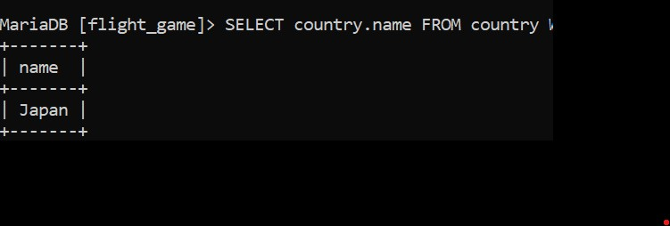
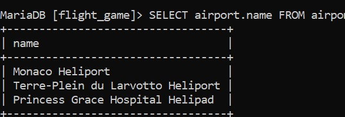
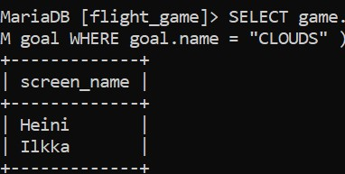
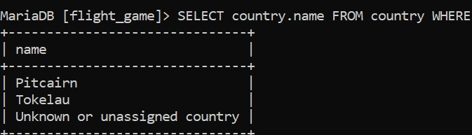
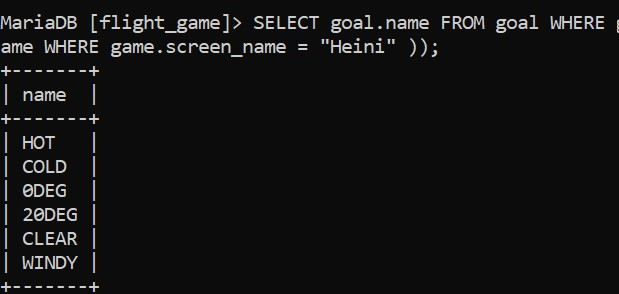

# Week 04
#  Exercise 05

## Task 01
SELECT country.name FROM country WHERE country.iso_country IN ( SELECT airport.iso_country FROM airport WHERE airport.name LIKE "Satsuma%" );

## Task 02
SELECT airport.name FROM airport WHERE airport.iso_country IN ( SELECT country.iso_country FROM country WHERE country.name = "Monaco" );

## Task 03
SELECT game.screen_name FROM game WHERE game.id IN ( SELECT goal_reached.game_id FROM goal_reached WHERE goal_reached.goal_id IN ( SELECT goal.id FROM goal WHERE goal.name = "CLOUDS" ));

## Task 04
SELECT country.name FROM country WHERE country.iso_country NOT IN ( SELECT DISTINCT airport.iso_country FROM airport );

## Task 05
SELECT goal.name FROM goal WHERE goal.id NOT IN ( SELECT goal_reached.goal_id FROM goal_reached WHERE goal_reached.game_id IN ( SELECT game.id FROM game WHERE game.screen_name = "Heini" ));

