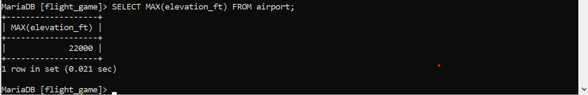
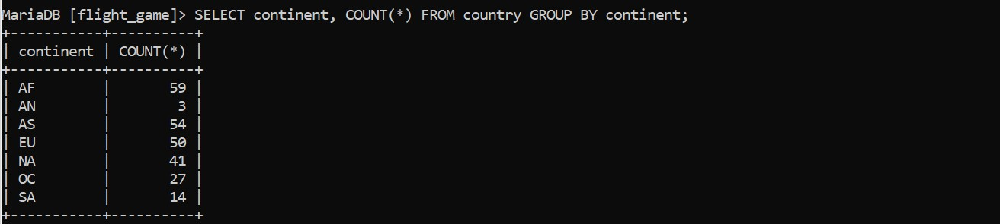
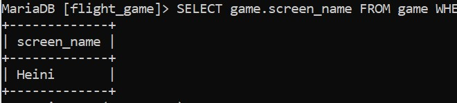
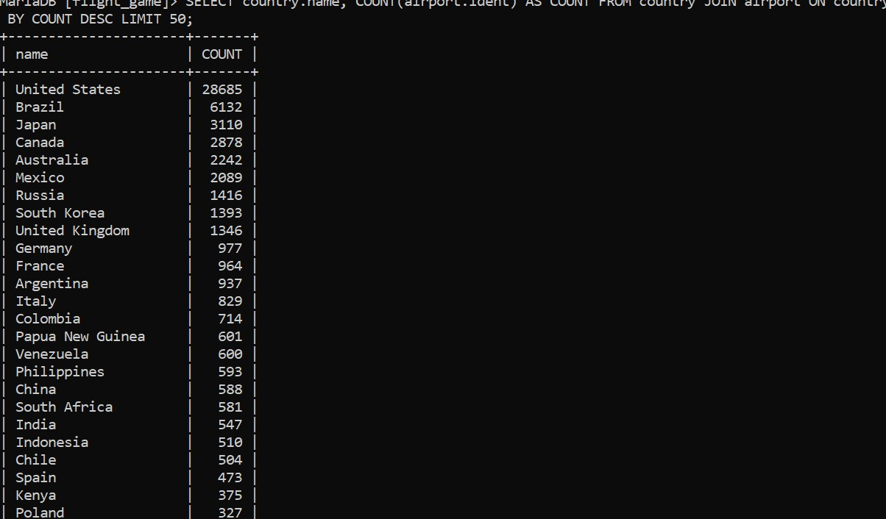
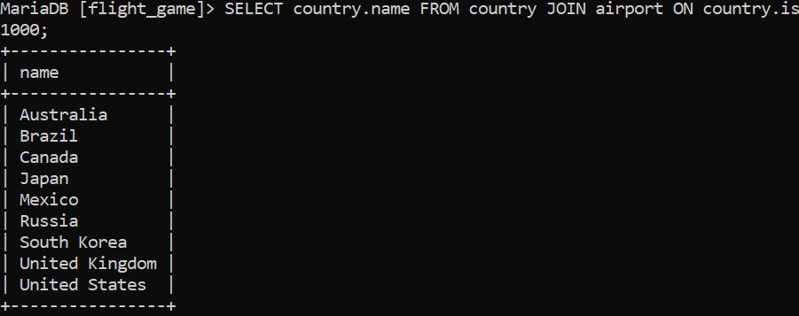
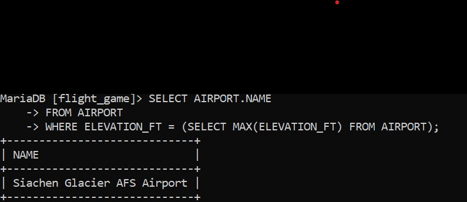
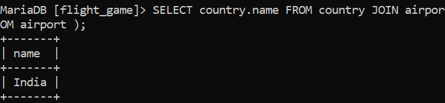
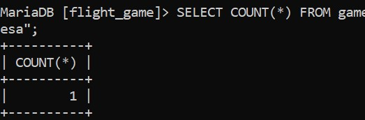
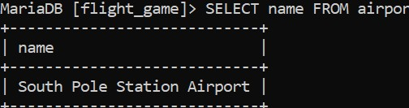

# Week 5
# Exercise 6

## Task 1
SELECT MAX(elevation_ft) FROM airport;

## Task 2
SELECT continent, COUNT(*) FROM country GROUP BY continent;

## Task 3
SELECT game.screen_name, COUNT(*) FROM game JOIN goal_reached ON game.id = goal_reached.game_id JOIN goal ON goal.id = goal_reached.goal_id GROUP BY game.screen_name;

## Task 4
SELECT game.screen_name FROM game WHERE co2_consumed = ( SELECT MIN(co2_consumed) FROM game );

## Task 5
SELECT country.name, COUNT(airport.ident) AS COUNT FROM country JOIN airport ON country.iso_country = airport.iso_country GROUP BY country.name ORDER BY COUNT DESC LIMIT 50;

## Task 6
SELECT country.name FROM country JOIN airport ON country.iso_country = airport.iso_country GROUP BY country.name HAVING COUNT(airport.iso_country) > 1000;

## Task 7
SELECT airport.name FROM airport WHERE elevation_ft = ( SELECT MAX(elevation_ft) FROM airport );

## Task 8
SELECT country.name FROM country JOIN airport ON country.iso_country = airport.iso_country WHERE airport.elevation_ft = ( SELECT MAX(elevation_ft) FROM airport );

## Task 9
SELECT COUNT(*) FROM game JOIN goal_reached ON game.id = goal_reached.game_id JOIN goal ON goal.id = goal_reached.goal_id WHERE game.screen_name = "Vesa";

## Task 10
SELECT name FROM airport WHERE ABS(latitude_deg) = ( SELECT MAX(ABS(latitude_deg)) FROM airport );

