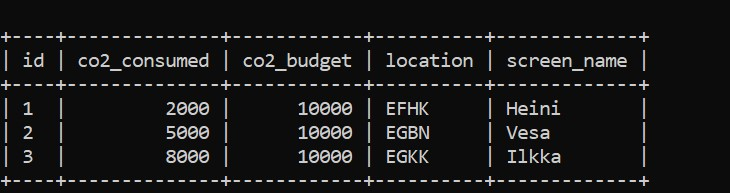
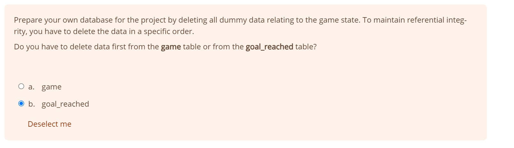
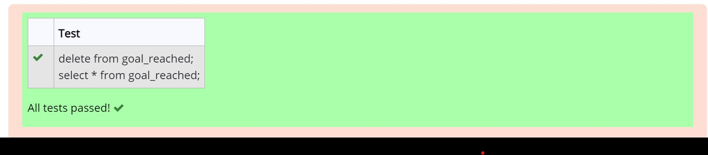
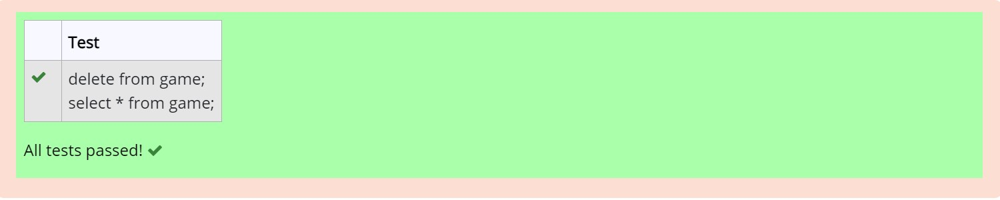

# Week 5
# Exercise 7

## Task 1
Update game set  location = (select ident from airport where name = "Nottingham Airport"), co2_consumed = co2_consumed+500 where screen_name = "Vesa"; select * from game;

## Task 2

## Task 3
DELETE FROM goal_reached;

## Task 4
DELETE FROM game;

